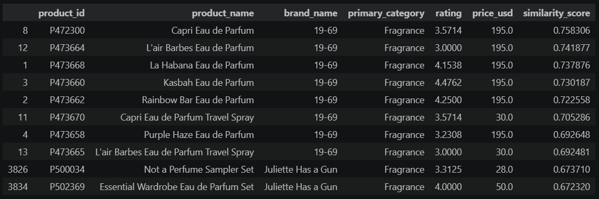
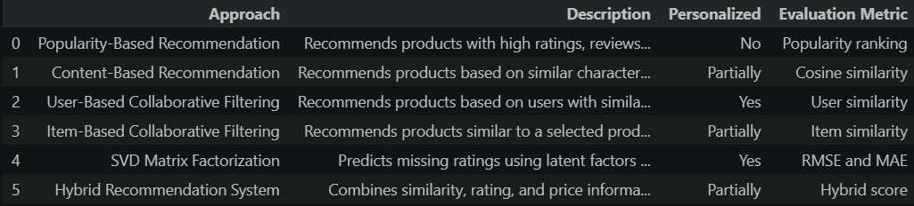
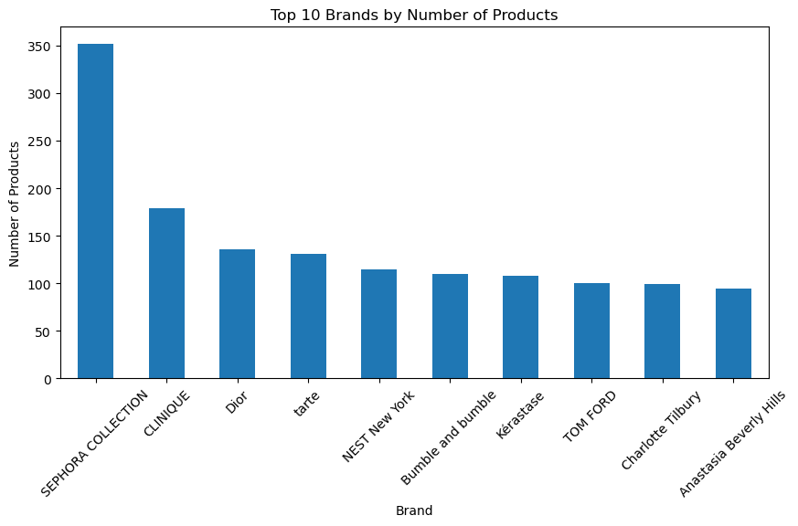
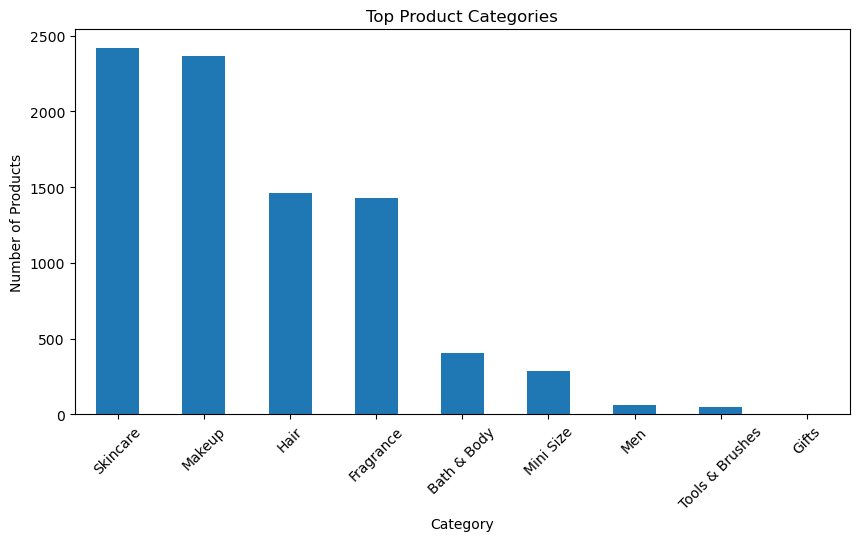

# Beauty Product Recommendation System

Developing a personalized beauty product recommendation system using Machine Learning and recommendation techniques.

---

## Project Overview

Recommendation systems play a fundamental role in modern e-commerce platforms by helping customers discover products that match their interests and preferences.

This project develops a Personalized Beauty Product Recommendation System using the Sephora Products and Skincare Reviews Dataset. Multiple recommendation techniques were implemented and analyzed, including Popularity-Based Recommendation, Content-Based Filtering, Collaborative Filtering, Matrix Factorization (SVD), and Hybrid Recommendation Systems.

The objective is to improve product discovery and personalization by recommending relevant beauty products based on product characteristics, customer behavior, and review patterns.

---

## Business Problem

Beauty retailers offer thousands of products across different categories, brands, and price ranges. Finding the right product can be challenging for customers, potentially affecting engagement and purchase decisions.

The objective of this project is to build recommendation models capable of suggesting relevant products based on customer preferences and product similarities, improving the overall shopping experience and supporting data-driven personalization strategies.

---

## Dataset

The project uses the **Sephora Products and Skincare Reviews Dataset**, which contains detailed information about beauty products and customer interactions.

The dataset contains information about:

* Product Information
* Product Categories
* Brand Information
* Product Prices
* Customer Ratings
* Customer Reviews
* Popularity Indicators (loves_count)
* User-Product Interactions

Dataset source:

https://www.kaggle.com/datasets/nadyinky/sephora-products-and-skincare-reviews

Due to GitHub file size limitations, the dataset files are not included in this repository.

To run this project, download the dataset from Kaggle and place the CSV files inside the `data/` folder using the following structure:

```text
data/
├── product_info.csv
├── reviews_0-250.csv
├── reviews_250-500.csv
├── reviews_500-750.csv
├── reviews_750-1250.csv
└── reviews_1250-end.csv
```

---

## Technologies Used

* Python
* Pandas
* NumPy
* Matplotlib
* Scikit-Learn
* SciPy
* TF-IDF Vectorization
* Cosine Similarity
* Singular Value Decomposition (SVD)
* Jupyter Notebook

---

## Project Workflow

1. Data Loading
2. Initial Data Exploration
3. Dataset Integration
4. Exploratory Data Analysis (EDA)
5. Data Cleaning and Preprocessing
6. Feature Engineering
7. Product Popularity Analysis
8. User-Product Matrix Creation
9. Sparsity Analysis
10. Popularity-Based Recommendation
11. Content-Based Recommendation
12. User-Based Collaborative Filtering
13. Item-Based Collaborative Filtering
14. Matrix Factorization (SVD)
15. Model Evaluation
16. Hybrid Recommendation System
17. Recommendation Approaches Overview
18. Business Insights and Conclusions

---

## Content-Based Recommendation Example

The Content-Based Recommendation model uses TF-IDF Vectorization and Cosine Similarity to identify products with highly similar characteristics.

<p align="center">
  
</p>

The model successfully identified products belonging to the same category and similar fragrance profiles, demonstrating its ability to capture product similarities and generate relevant recommendations.

---

## Recommendation Approaches Overview

The project implements multiple recommendation techniques commonly used in modern recommendation systems.

<p align="center">
  
</p>

Implemented approaches:

* Popularity-Based Recommendation
* Content-Based Recommendation
* User-Based Collaborative Filtering
* Item-Based Collaborative Filtering
* Matrix Factorization (SVD)
* Hybrid Recommendation System

Each technique addresses personalization from a different perspective, ranging from product popularity to user behavior and latent preference prediction.

---

## Exploratory Analysis

### Top Brands

<p align="center">
  
</p>

SEPHORA COLLECTION appears as the most represented brand in the dataset, followed by major beauty brands such as CLINIQUE, Dior, Tarte, and NEST New York.

---

### Top Product Categories

<p align="center">
  
</p>

Skincare and Makeup dominate the product catalog, highlighting their importance within the beauty industry and their relevance for recommendation strategies.

---

## Model Evaluation

Matrix Factorization using SVD was evaluated using RMSE and MAE metrics.

| Metric | Value |
| ------ | ----- |
| RMSE   | 3.99  |
| MAE    | 3.78  |

The relatively high error values can be partially explained by the extreme sparsity of the user-product matrix, which reached approximately 99.53%.

This highlights one of the main challenges of recommendation systems, where customers typically interact with only a small fraction of the available products.

---

## Key Business Insights

The exploratory analysis and recommendation models revealed several important business insights:

* Skincare and Makeup categories dominate the product catalog.
* Several of the most loved products belong to brands such as Rare Beauty, NARS, Fenty Beauty, and The Ordinary.
* Customer reviews are highly concentrated in ratings 4 and 5.
* The user-product matrix presented a sparsity level of approximately 99.53%.
* Content-Based Recommendation successfully identified highly similar products.
* Hybrid Recommendation approaches provide a balanced strategy for personalization.

These findings demonstrate how recommendation systems can improve product discovery and customer engagement within the beauty industry.

---

## Project Structure

```text
Beauty_Product_Recommendation_System/
│
├── data/
│   ├── product_info.csv
│   ├── reviews_0-250.csv
│   ├── reviews_250-500.csv
│   ├── reviews_500-750.csv
│   ├── reviews_750-1250.csv
│   └── reviews_1250-end.csv
│
├── images/
│   ├── content_based_recommendation.png
│   ├── recommendation_approaches_overview.png
│   ├── top_brands.png
│   └── top_categories.png
│
├── notebooks/
│   └── beauty_recommendation_system.ipynb
│
├── README.md
├── requirements.txt
└── .gitignore
```

---

## Author

**Talita Niqian Lin Wu**

LinkedIn:
https://www.linkedin.com/in/talita-niqian-lin-wu/

GitHub:
https://github.com/TalitaNLinWu
